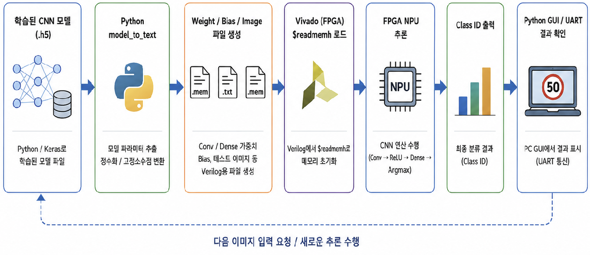
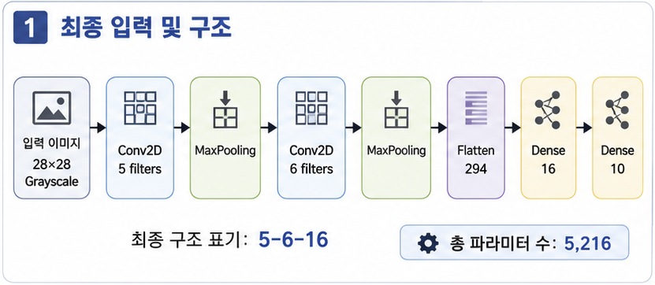

<!-- 상단 타이틀 이미지가 있다면 여기에 추가하세요 (예: images/title.png) -->
<!--  -->

# 🚦 Project 8 Traffic Sign Classification System


## 📌 1. Project Summary (프로젝트 요약)

Basys3(Artix-7 FPGA)에 CNN 추론 로직을 직접 RTL로 구현한 NPU로, 교통 표지판 10종을 분류하는 시스템


## ✨ 2. Key Features (주요 기능)

- CNN-based Traffic Sign Classification (CNN 기반 표지판 분류)
- PyQt5 GUI 기반 PC 데모 프로그램 구성
- 예측된 클래스 인덱스(0~9)를 Basys3 7-세그먼트에 실시간 표시


## 🛠 3. Tech Stack (기술 스택)

### 3.1 Language (사용 언어)


### 3.2 Development Environment (개발 환경)

| Tool | Description |
| --- | --- |
| **AMD Vivado** | RTL 설계, 합성/구현, XSim 시뮬레이션, bitstream 생성 |
| **PyCharm / TensorFlow(Keras)** | GTSRB CNN 학습, 정수 양자화, weight/bias export |
| **PyQt5** | PC ↔ FPGA UART 실시간 데모 GUI |

### 3.3 Collaboration Tools (협업 도구)


### 3.4 Target Hardware (대상 하드웨어)

| Hardware | Description |
| --- | --- |
| Basys3 | Artix-7 XC7A35T FPGA 개발 보드 (100MHz) |
| USB-UART | PC ↔ FPGA 이미지/결과 송수신 (115,200 baud) |
| 7-Segment | 예측 클래스 인덱스 출력 |
| PC (PyQt5) | 이미지 선택, 전처리, 결과 시각화 |

## 📂 4. Project Structure (프로젝트 구조)

### 4.1 Project Tree (프로젝트 트리)

```
project_8_traffic_sign_classification_system/
├── train_gtsrb_rgb_c5_c6_d16.py     # GTSRB 10-class CNN 학습 (Keras)
├── model_to_text.py                 # Keras 가중치 -> Q7 .mem 파일 export
├── fpga_npu_gui.py                  # PC <-> FPGA UART 실시간 데모 GUI (PyQt5)
│
├── gtsrb_10class_grayscale_c5_c6_d16_three_seed_results/
│   ├── grayscale_c5_c6_d16_split100_train100/
│   │   ├── best_model_...split100_train100.keras     # 배포 모델
│   │   └── classification_report_...txt              # 정확도 리포트
│   ├── overall_run_summary_...csv                    # 3-seed 종합 결과
│   └── class_stability_summary_...csv                # 클래스별 안정성 분석
│
└── vivado/
    └── traffic_sign_classification_system.srcs/
        ├── sources_1/imports/files_1/
        │   ├── npu_top.v            # Basys3 top: UART/이미지 로더/사이클 카운터/FND
        │   ├── npu_core.v           # CNN 추론 코어 (FSM + 고정소수점 MAC)
        │   ├── uart_rx.v            # UART 수신
        │   ├── uart_tx.v            # UART 송신
        │   ├── seven_seg.v          # 7-세그먼트 디스플레이
        │   └── out/mem/             # 양자화 가중치/바이어스 (.mem x8)
        │       ├── conv1_w.mem / conv1_b.mem
        │       ├── conv2_w.mem / conv2_b.mem
        │       ├── dense1_w.mem / dense1_b.mem
        │       └── dense2_w.mem / dense2_b.mem
        └── constrs_1/imports/files_1/
            └── basys3_npu.xdc       # 핀 제약 (clk W5, RsRx B18, RsTx A18)
```

### 4.2 System flow chart(시스템 플로우 차트)



### 4.3 CNN Architecture (모델 구조)



### 4.4 Data Flow (동작 순서)

```
1. GUI에서 GTSRB 테스트 이미지 폴더 열기 (썸네일 그리드)
2. 썸네일 선택 -> 28x28 흑백 전처리 -> Q7(×128) 양자화 -> 784바이트
3. UART로 FPGA 전송, npu_top이 img_mem에 784픽셀 적재
4. 784번째 바이트 수신 시 core_start -> npu_core FSM 추론 시작
5. Conv1->Pool1->Conv2->Pool2->Dense1->Dense2->Argmax 순차 수행
6. done 상승 시 46바이트 결과 패킷 송신 + FND에 예측 클래스 표시
7. GUI가 패킷 파싱 -> 클래스명 + softmax confidence 표시
```

## 🎯 5. Model & Dataset (모델 및 데이터셋)

### 5.1 Target Classes (분류 대상 10종)

GTSRB(German Traffic Sign Recognition Benchmark) 43종 중 안정적으로 학습되는 10종을 선별했습니다.

| Label | GTSRB ID | Class Name | F1-score |
| :---: | :---: | --- | :---: |
| 0 | 13 | 양보 (Yield) | 0.9970 |
| 1 | 14 | 정지 (Stop) | 0.9707 |
| 2 | 17 | 진입 금지 (No entry) | 0.9805 |
| 3 | 18 | 일반 위험 도로 (General caution) | 0.9175 |
| 4 | 25 | 도로 공사 중 (Road work) | 0.8796 |
| 5 | 28 | 어린이 횡단 주의 (Children crossing) | 0.9663 |
| 6 | 33 | 우회전 지시 (Turn right ahead) | 0.9045 |
| 7 | 34 | 좌회전 지시 (Turn left ahead) | 0.9836 |
| 8 | 35 | 직진 지시 (Ahead only) | 0.9860 |
| 9 | 40 | 회전교차로 (Roundabout) | 0.9677 |

### 5.2 Training Results (학습 결과)

배포 모델(`split100_train100`) 기준 성능입니다. Split seed를 42/100/2026 세 가지로 나눠 클래스별 안정성을 검증했습니다.

| Metric | Value |
| --- | --- |
| Input | 28×28 grayscale (1 channel) |
| Architecture | Conv5 → Pool → Conv6 → Pool → Dense16 → Dense10 |
| Test Accuracy | **95.56%** |
| Macro F1 | **0.9554** |
| Weighted F1 | 0.9550 |
| Test Loss | 0.2569 |

> `class_stability_summary` 결과, 좌/우회전 지시(33/34)는 seed에 따라 F1 편차가 커 관찰이 필요한 클래스로 분류됩니다.

## 🔌 6. NPU Core Description (NPU 코어 설명)

### 6.1 Fixed-Point Scheme (고정소수점 규약)

| 항목 | 포맷 | 설명 |
| --- | --- | --- |
| Input | Q7 (signed 8-bit) | 픽셀값 ×128 스케일 |
| Weight | Q7 (signed 8-bit) | 가중치 ×128 스케일 |
| Bias / Accumulator | Q14 (signed 32-bit) | Q7 × Q7 = Q14 |
| Hidden Activation | Q7 | Q14 → Q7 requantize + ReLU + clamp |

### 6.2 Inference FSM (추론 상태 머신)

각 레이어를 `INIT → READ → MUL → ACC → WB` 단계로 나눠 순차 처리합니다. 메모리 read와 MAC 연산을 분리해 동기식 BRAM 추론에 맞도록 타이밍을 최적화했습니다.

```
S_IDLE
  -> C1(INIT/READ/MUL/ACC/WB)  : Conv1  28x28x1 -> 28x28x5
  -> P1(READ/ACC/WB)           : Pool1  -> 14x14x5
  -> C2(INIT/READ/MUL/ACC/WB)  : Conv2  -> 14x14x6
  -> P2(READ/ACC/WB)           : Pool2  -> 7x7x6
  -> D1(INIT/READ/MUL/ACC/WB)  : Dense1 294 -> 16 (ReLU)
  -> D2(INIT/READ/MUL/ACC/WB)  : Dense2 16 -> 10
  -> ARG                       : argmax (strict >, 낮은 index 우선)
```

### 6.3 On-Chip Memory Map (온칩 메모리 구성)

| Memory | Size | 용도 | 스타일 |
| --- | --- | --- | --- |
| `img_mem` | 784 (28×28) | 입력 이미지 | block |
| `c1_mem` | 3920 (28×28×5) | Conv1 출력 | block |
| `p1_mem` | 980 (14×14×5) | Pool1 출력 | block |
| `c2_mem` | 1176 (14×14×6) | Conv2 출력 | block |
| `p2_mem` | 294 (7×7×6) | Pool2 출력 | block |
| `d1_mem` | 16 | Dense1 출력 | distributed |
| `logit_mem` | 10 | 최종 로짓 | reg |
| `c1w/c2w/d1w/d2w` | 45 / 270 / 4704 / 160 | 가중치 ROM | block |

## 💻 7. UART Protocol (통신 프로토콜)

### 7.1 PC → FPGA (Image)

```
784 bytes : Q7 양자화된 28x28 grayscale 픽셀 (raster order)
            784번째 바이트 수신 시 자동으로 추론 시작
```

### 7.2 FPGA → PC (Result Packet, 46 bytes)

| Offset | Size | 내용 |
| --- | --- | --- |
| `0` | 1 | 헤더 `0xAA` |
| `1` | 1 | 예측 클래스 (0~9) |
| `2 ~ 41` | 40 | 로짓 10개 × int32 (little-endian) |
| `42 ~ 45` | 4 | 순수 추론 사이클 수 uint32 (little-endian) |

> 사이클 카운터는 `core_start`부터 `done` 상승까지의 순수 추론 사이클만 측정하므로, UART 전송 지연과 분리해 하드웨어 연산 성능을 정확히 확인할 수 있습니다.

## ⚙️ 8. Build & Run (빌드 및 실행)

### 8.1 Training (학습, 선택)

```bash
python train_gtsrb_rgb_c5_c6_d16.py   # GTSRB 10-class CNN 학습 -> .keras
python model_to_text.py               # Q7 양자화 -> out/mem/*.mem 8개 생성
```

### 8.2 Vivado (합성 및 보드 프로그래밍)

```
1. vivado/traffic_sign_classification_system.xpr 열기
2. .mem 8개가 시뮬레이션/구현 경로에 포함되어 있는지 확인
3. Run Synthesis -> Run Implementation -> Generate Bitstream
4. Basys3에 bitstream program
```

### 8.3 GUI (PC 데모)

```bash
pip install pyqt5 pyserial opencv-python numpy
python fpga_npu_gui.py
```

```
1. COM 포트 선택 후 연결 (115,200 baud)
2. GTSRB 테스트 이미지 폴더 열기
3. 썸네일 클릭 -> FPGA 추론 -> 예측 클래스 & confidence 확인
4. FND에 표시된 클래스 인덱스와 GUI 결과 비교
```

## 🏁 9. Results & Demonstration (결과 및 시연)

### 9.1 Verification (검증 결과)

- Keras 부동소수점 → Q7 정수 양자화 후에도 test accuracy 95.56% 유지
- Python golden model과 RTL(XSim) 추론 결과 **bit-exact** 일치 확인
- 실보드에서 UART 전송 → NPU 추론 → 결과 수신 → FND 표시 통합 동작 확인
- 순수 추론 약 104,600 cycle ≈ 1.05ms @ 100MHz 측정

<!-- 데모 사진/GIF가 있다면 여기에 추가하세요 -->
<!--  -->
<!--  -->

## 10. Troubleshooting (문제 해결 기록)

### 10.1 Python vs FPGA 예측 불일치

🔍 **Issue** — 특정 이미지에서 Keras와 FPGA 예측 클래스가 달라짐

❓ **Analysis** — `model_to_text.py`의 weight reshape 순서가 RTL의 HWC 메모리 배치와 어긋나, 같은 가중치가 다른 위치에 매핑됨

❗ **Action** — export 시 reshape 순서를 RTL flatten 규약 `(y*7+x)*6+c`와 일치시키고, argmax tie-break를 strict `>`(낮은 index 우선)로 통일

✅ **Result** — golden model과 XSim 결과가 bit-exact하게 일치

---

### 10.2 큰 활성 메모리의 합성 문제

🔍 **Issue** — 초기 버전에서 활성 메모리/가중치를 비동기 read로 작성해 거대한 LUT MUX가 생성되고 타이밍이 악화됨

❗ **Action** — `ram_style="block"` / `rom_style="block"` 속성과 동기식 read 코딩으로 변경하고, 메모리 read와 MAC를 서로 다른 FSM 상태로 분리. Max pooling도 4픽셀 병렬 대신 1픽셀씩 순차 read

✅ **Result** — BRAM/ROM으로 정상 추론하며 타이밍 확보

---

### 10.3 XSim 시뮬레이션이 조기 종료됨

🔍 **Issue** — 기본 run 시간이 너무 짧아 추론이 끝나기 전에 시뮬레이션이 종료됨

❓ **Analysis** — top module 변경 후 stale snapshot이 남아 `current_scope`가 잘못된 계층을 가리킴

❗ **Action** — top module 변경 후 `current_scope`로 계층 확인, `restart` 대신 close 후 재실행, Tcl 콘솔에서 `run all`로 전체 추론 완료까지 실행

✅ **Result** — 전체 추론 파형과 결과 패킷을 정상 확인

---

### 10.4 팀원 환경에서 GUI 실행 실패

🔍 **Issue** — 팀원 PC에서 `serial` import 오류 및 OpenCV Qt 플러그인 충돌 발생

❗ **Action** — `serial`이 아닌 `pyserial` 설치로 정정하고, `opencv-python`과 Qt 충돌 시 `opencv-python-headless`로 교체. Keras 버전 명시를 포함한 `requirements.txt` 배포

✅ **Result** — 팀원 환경에서 GUI 정상 실행 및 데모 재현 확인
